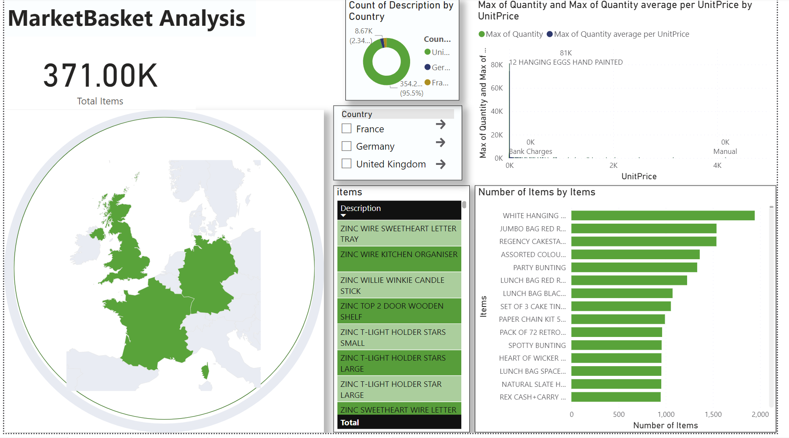

# 🛒 Market Basket Analysis with Apriori Algorithm  

## 📌 Project Overview  
This project applies **Market Basket Analysis (MBA)** on a retail dataset to uncover hidden associations between items frequently purchased together.  
Using the **Apriori Algorithm**, we identify meaningful patterns, visualize item relationships, and build an **interactive Power BI dashboard** for deeper insights.  

The dataset covers transactions from **UK, Germany, and France**, making the analysis cross-cultural and comprehensive.  

---

## 🚩 Problem Statement  
Retailers face challenges in:  
- Understanding **consumer buying behavior** from large datasets  
- Identifying **product combinations** frequently bought together  
- Optimizing **product placement, promotions, and inventory**  
- Adapting strategies across **different countries and cultures**  

Traditional methods are insufficient for analyzing millions of transactions.  
This project uses **data mining techniques** to extract actionable business insights.  

---

## 🔎 Approach  

1. **Data Collection**  
   - Retail dataset sourced from **Kaggle** (38 countries; filtered for UK, Germany, and France).  
   - Features: Invoice No, Product Description, Quantity, Price, Customer ID, Country.  

2. **Data Preprocessing**  
   - Removed duplicates and cancelled invoices  
   - Cleaned product descriptions & standardized formats  
   - Transformed dataset into **transactional matrix** (1/0 encoding for product presence)  

3. **Apriori Algorithm**  
   - Applied with **support ≥ 0.03**  
   - Extracted **association rules** with metrics: Support, Confidence, and Lift  

4. **Visualization**  
   - **Python**: Bar Charts, Pie Charts, Heatmaps, 3D Scatter Plots  
   - **Power BI Dashboard**: Interactive visual analytics of country-wise patterns  

---

## 📂 Dataset  
The dataset used in this project is available on Kaggle:  
🔗 [Online Retail Dataset](https://www.kaggle.com/datasets/hellbuoy/online-retail-dataset)  

It contains retail transactions from multiple countries.  
For this project, we focused on **UK, Germany, and France**. 

## 📊 Results & Insights  

- **Strong Association Rules**  
  - Products frequently bought together identified (e.g., _Product A_ → _Product B_)  
  - Lift > 1 indicates **positive relationships**  

- **Cross-Country Comparison**  
  - **UK**: Luxury & seasonal items dominate  
  - **Germany**: Household products more frequent  
  - **France**: Balanced mix of daily essentials and gifts  

- **Business Impact**  
  - Enables **strategic product placement**  
  - Improves **cross-selling opportunities**  
  - Optimizes **inventory management**  

---

## 📸 Screenshots  

> 📌 Add your images inside a `screenshots/` folder in your repo and link them here.  
 

- **Power BI Dashboard**  
    

---

## 🛠️ Tech Stack  
- **Python**: Pandas, NumPy, MLxtend, Matplotlib, Seaborn, Plotly  
- **Power BI**: Interactive dashboard  
- **Dataset**: Online Retail (Kaggle)  

---

## 📌 Conclusion  
This project demonstrates how **Market Basket Analysis** can help retailers:  
- Boost **sales via targeted marketing**  
- Reduce **inventory waste**  
- Enhance **customer satisfaction**  

By combining **Apriori Algorithm** with **visualization tools**, we uncover valuable retail insights across multiple countries.  

---

## 👤 Author  
**Muhammad Usman**  
IoT & Data Science Enthusiast | Embedded Systems | AI & ML Applications  

🔗 [LinkedIn](https://linkedin.com/in/usman-yousuf-2k)  

